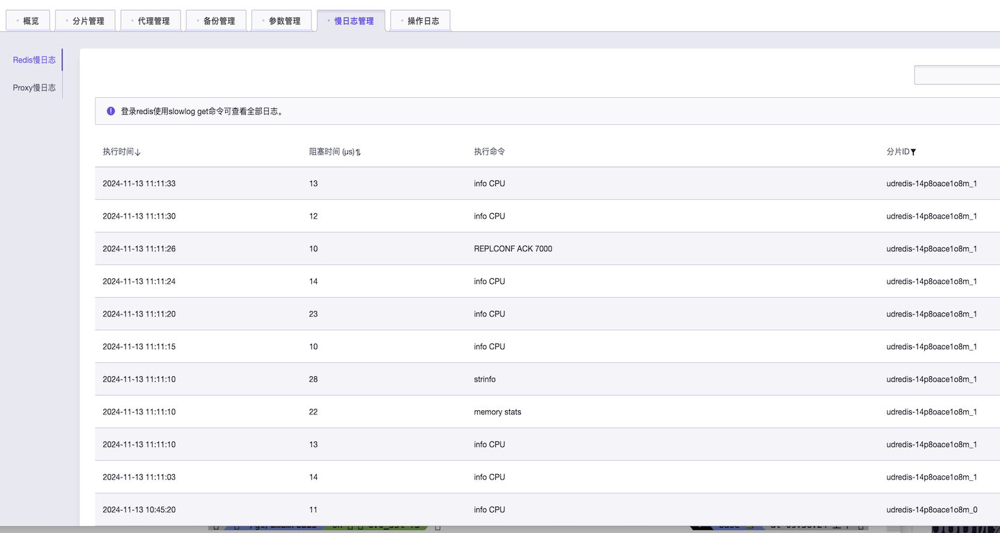

# 分布式版慢日志管理
分布式版本慢日志分为Redis慢日志和Proxy慢日志。

## Redis慢日志
Redis分片慢日志位于慢日志管理的第一个Tab页面。如下图所示： 

Redis慢日志页面总共分四列，详细说明如下 ： 
执行时间：慢日志产生的时间。 
阻塞时间：该命令的执行花费的时间。 
执行命令：具体执行的命令。 
分片ID：该慢日志所在的分片。 

## Proxy慢日志
Proxy慢日志位于Redis慢日志Tab的下面。 
代理慢日志页面通过下拉选择框选择要查看的指定的代理的慢日志，如下图所示： 

选择完一个具体代理之后，慢日志会显示出来，代理慢日志也有四列，详细的说明如下： 
执行时间：慢日志产生的时间。 
客户端：该条慢日志执行的客户端IP和端口。 
阻塞时间：该命令执行花费的时间。 
执行命令：具体执行的命令。 