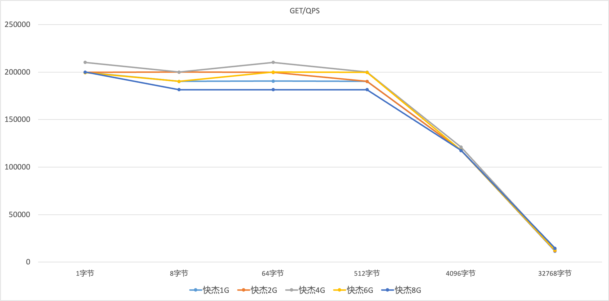

# 压力测试

## 物理机普通机型测试

测试条件

1.开启pipeline，不同连接数.

2.关闭pipeline，不同连接数

3.开启pipeline，不同Data size

测试脚本模板：

```
#!/bin/bash
for clients in {1,2,4,8,16,32,64,128,256,512,800}; do
echo $clients
redis-benchmark  -c $clients -n 5000000 -P 100 -h 10.10.214.139  -d 256 -t get,set -q
done
```

测试结果：

华北一可用区B

1.开启pipeline，不同连接数

```
redis-benchmark  -c $连接数 -n 5000000 -P 100 -h IP  -d 256 -t get,set
```


2.关闭pipeline，不同连接数

```
redis-benchmark  -c $连接数 -n 1000000 -h IP -d 256 -t get,set -q
```


3.开启pipeline，不同Data size

```
redis-benchmark -c 64 -n 5000000 -P 100 -h IP -d $字节 -t get,set -q
```


## 快杰主备redis产品测试
### 测试环境
#### redis-server
软件版本：6.0

服务器机型：快杰版主备redis、物理机普通机型

产品规格：快杰1G、快杰2G、快杰4G、快杰6G、快杰8G、物理机普通机型

#### redis-benchmark
服务器机型： 快杰O型

系统版本：CentOS 8.3

机器配置：16C/16G

#### memtier_benchmark
服务器机型： 快杰O型

系统版本：CentOS 6.4

机器配置：16C/16G
### 测试场景
#### 1. 不同连接数，关闭pipeline
测试脚本：
```
#!/bin/bash
for clients in {1,2,4,8,16,32,64,128,256,512,800}; do
    redis-benchmark  -c $连接数 -n 1000000 -h IP -d 256 -t get,set -q --threads 4
done
```
##### 测试结果
Set性能<br />

| 连接数 | 1 | 2 | 4 | 8 | 16 | 32 | 64 | 128 | 256 | 512 | 800 |
| -- | -- | -- | -- | -- | -- | -- | -- | -- | -- | -- | -- |
| 快杰1G | 14118 | 26991 | 50571 | 83222 | 117619 | 137741 | 153822 | 166417 | 147819 | 153609 | 153421 |
| 快杰2G | 14067 | 27550 | 51986 | 85077 | 105241 | 142653 | 163671 | 142633 | 142612 | 153468 | 159565 |
| 快杰4G | 13921 | 28136 | 51221 | 84997 | 117495 | 142673 | 159769 | 159769 | 159846 | 159616 | 153421 |
| 快杰6G | 13921 | 27773 | 48711 | 85091 | 114116 | 142653 | 166334 | 166417 | 166361 | 153444 | 153444 |
| 快杰8G | 14068 | 27939 | 50568 | 86850 | 117495 | 142633 | 159744 | 159718 | 159872 | 159769 | 147819 |
| 物理机普通机型 | 8979 | 16774 | 28036 | 40722 | 52919 | 59917 | 64263 | 66813 | 68694 | 69101 | 72364 |

Get性能<br />

| 连接数 | 1 | 2 | 4 | 8 | 16 | 32 | 64 | 128 | 256 | 512 | 800 |
| -- | -- | -- | -- | -- | -- | -- | -- | -- | -- | -- | -- |
| 快杰1G | 16509 | 30972 | 58750 | 102438 | 153657 | 181587 | 210482 | 199720 | 199680 | 190258 | 199521 |
| 快杰2G | 15667 | 28951 | 57960 | 96880 | 142673 | 173671 | 189720 | 188680 | 180817 | 181827 | 192216 |
| 快杰4G | 16509 | 30733 | 57690 | 97880 | 142673 | 181620 | 199760 | 190367 | 190403 | 189760 | 192897 |
| 快杰6G | 16578 | 30709 | 57822 | 98427 | 142653 | 173671 | 190216 | 199680 | 195114 | 191587 | 212024 |
| 快杰8G | 16578 | 30815 | 59633 | 102553 | 142836 | 190222 | 210260 | 190186 | 199920 | 210128 | 209995 |
| 物理机普通机型 | 9973 | 19272 | 31571 | 47803 | 66246 | 86145 | 90371 | 90973 | 93531 | 95892 | 91907 |
##### 折线图
Set QPS <br />

Get QPS <br />


#### 2. 不同data size，关闭pipeline
测试脚本：
```
#!/bin/bash
for data_size in {1,8,64,512,4096}; do
    redis-benchmark -c 64 -n 1000000 -h IP -d $data_size -t get,set -q --threads 4
done
# 32KiB大小的data size长时间跑容易使1GB容量规格实例oom。
data_size=32768
redis-benchmark -c 64 -n 50000 -P 100 -h IP -d $data_size -t get,set -q --threads 4
```
##### 测试结果
Set性能<br />

| 字节 | 1字节 | 8字节 | 64字节 | 512字节 | 4096字节 | 32768字节 |
| -- | -- | -- | -- | -- | -- | -- |
| 快杰1G | 173671 | 173852 | 166444 | 128998 | 66622 | 13078 |
| 快杰2G | 181521 | 173671 | 159769 | 137741 | 65449 | 13077 |
| 快杰4G | 181752 | 181587 | 173671 | 142816 | 61413 | 12659 |
| 快杰6G | 166417 | 159795 | 166472 | 147928 | 68922 | 13075 |
| 快杰8G | 181554 | 163609 | 152694 | 143657 | 66613 | 12676 |

Get性能<br />

| 字节 | 1字节 | 8字节 | 64字节 | 512字节 | 4096字节 | 32768字节 |
| -- | -- | -- | -- | -- | -- | -- |
| 快杰1G | 199680 | 190186 | 190439 | 190222 | 117467 | 61425 |
| 快杰2G | 199720 | 199960 | 199720 | 190186 | 117605 | 57028 |
| 快杰4G | 210260 | 199960 | 210216 | 199960 | 121036 | 53319 |
| 快杰6G | 199415 | 190222 | 199920 | 199680 | 117605 | 61519 |
| 快杰8G | 199920 | 181554 | 181554 | 181554 | 117481 | 57110 |
##### 折线图
Set QPS <br />

Get QPS <br />

#### 3. 不同连接数，开启pipeline
测试脚本：
```
#!/bin/bash
for clients in {1,2,4,8,16,32,64,128,256,512,800}; do
    redis-benchmark  -c $clients -n 5000000 -P 100 -h IP  -d 256 -t get,set -q --threads 4
done
```
##### 测试结果
Set性能<br />

| 连接数 | 1 | 2 | 4 | 8 | 16 | 32 | 64 | 128 | 256 | 512 | 800 |
| -- | -- | -- | -- | -- | -- | -- | -- | -- | -- | -- | -- |
| 快杰1G | 332933 | 487044 | 486854 | 524989 | 525430 | 525265 | 511561 | 498305 | 463907 | 433162 | 406471 |
| 快杰2G | 350434 | 475465 | 511823 | 539257 | 525430 | 511770 | 498454 | 511142 | 453391 | 424052 | 442712 |
| 快杰4G | 356709 | 475330 | 539548 | 539374 | 524824 | 511718 | 524989 | 511195 | 464037 | 443262 | 414593 |
| 快杰6G | 344400 | 475556 | 512242 | 525154 | 525320 | 538851 | 498902 | 511195 | 498256 | 423980 | 415006 |
| 快杰8G | 350459 | 487187 | 540073 | 539374 | 539723 | 554262 | 538793 | 511665 | 463520 | 433200 | 398883 |
| 物理机普通机型 | 137155 | 165579 | 182681 | 178424 | 189343 | 184836 | 195266 | 207331 | 202609 | 193318 | 190614 |

Get性能<br />

| 连接数 | 1 | 2 | 4 | 8 | 16 | 32 | 64 | 128 | 256 | 512 | 800 |
| -- | -- | -- | -- | -- | -- | -- | -- | -- | -- | -- | -- |
| 快杰1G | 665778 | 1174536 | 1537042 | 1662786 | 1537042 | 1663893 | 1532801 | 1533742 | 1424095 | 1532332 | 1421666 |
| 快杰2G | 644329 | 1109631 | 1535626 | 1663340 | 1663893 | 1662234 | 1534212 | 1661681 | 1534683 | 1423284 | 1328021 |
| 快杰4G | 645778 | 1174812 | 1537111 | 1606782 | 1663893 | 1661681 | 1662234 | 1662234 | 1662786 | 1533272 | 1532332 |
| 快杰6G | 645867 | 1051082 | 1663340 | 1665001 | 1665001 | 1711594 | 1661129 | 1660577 | 1661129 | 1532801 | 1531393 |
| 快杰8G | 644246 | 1174536 | 1665556 | 1663340 | 1663340 | 1661681 | 1533742 | 1533742 | 1535626 | 1533742 | 1423284 |
| 物理机普通机型 | 230075 | 406834 | 418795 | 475737 | 491980 | 498952 | 505152 | 542711 | 501705 | 501403 | 482020 |

##### 折线图
Set QPS <br />

Get QPS <br />

#### 4. 短链接压测
短链接的压测主要是测试在不同读写比例情况下不同规格redis产品的性能。<br />
测试脚本：
```
#!/bin/bash
memtier_benchmark -s IP -p 6379 -c 30 -t 8 -n 1000 --ratio=10:0 --reconnect-interval=1
memtier_benchmark -s IP -p 6379 -c 30 -t 8 -n 1000 --ratio=5:5 --reconnect-interval=1
memtier_benchmark -s IP -p 6379 -c 30 -t 8 -n 1000 --ratio=0:10 --reconnect-interval=1
```
##### 测试结果

| 读写比例 | 10:0 | 5:5 | 0:10 |
| -- | -- | -- | -- |
| 快杰1G | 29111 | 28039 | 28433 |
| 快杰2G | 27748 | 28136 | 27952 |
| 快杰4G | 28269 | 28190 | 27664 |
| 快杰6G | 27491 | 27870  | 28297 |
| 快杰8G | 28037 | 27965 | 27916 |
