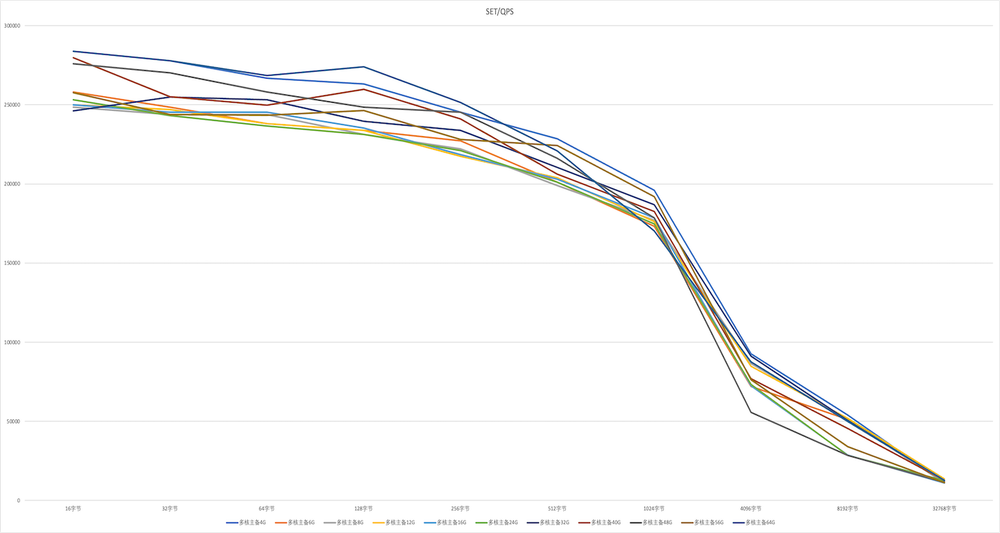

# 压力测试

## 性能加强版redis产品测试

#### redis-server
软件版本：性能加强版redis

产品规格：4G、6G、8G、12G、16G、24G、32G、40G、52G、64G

#### redis-benchmark
服务器机型： 快杰O型

系统版本：CentOS 8.3

机器配置：16C/16G

### 测试场景
#### 1. 不同连接数
测试脚本：
```
#!/bin/bash
for clients in {1,2,4,8,32,64,128,256,512,800}; do
    redis-benchmark -c $clients -n 10000000 -h IP -d 256 -t get,set -q --threads 8
done
```

#### 测试结果
Set性能<br />

| 连接数 | 1 | 2 | 4 | 8 | 32 | 64 | 128 | 256 | 512 | 800 |
| --- | --- | --- | --- | --- | --- | --- | --- | --- | --- | --- |
| 多核主备4G | 18669 | 34442 | 55594 | 66216 | 193702 | 227917 | 230542 | 226623 | 223428 | 227855 |
| 多核主备6G | 18070 | 30221 | 58308 | 76917 | 200934 | 240934 | 232541 | 231197 | 232498 | 227195 |
| 多核主备8G | 19633 | 34442 | 64437 | 76913 | 195114 | 219770 | 218574 | 217386 | 217339 | 219712 |
| 多核主备12G | 19827 | 36993 | 65492 | 69315 | 157475 | 217386 | 220984 | 215049 | 204035 | 209929 |
| 多核主备16G | 19976 | 34891 | 66666 | 81457 | 191372 | 224709 | 224714 | 216202 | 218541 | 219702 |
| 多核主备24G | 20626 | 36619 | 63592 | 77058 | 176202 | 188675 | 228560 | 210508 | 220935 | 220945 |
| 多核主备32G | 17908 | 34013 | 56576 | 59622 | 200996 | 238083 | 239503 | 231203 | 228529 | 228503 |
| 多核主备40G | 20723 | 39170 | 69565 | 104437 | 155634 | 238089 | 248434 | 239503 | 235249 | 235244 |
| 多核主备48G | 17756 | 34071 | 61162 | 103358 | 178558 | 231203 | 245398 | 233912 | 227231 | 228508 |
| 多核主备56G | 18801 | 31629 | 60352 | 105680 | 190421 | 228169 | 233481 | 220526 | 237450 | 227863 |
| 多核主备64G | 18243 | 34441 | 60990 | 105259 | 123819 | 227252 | 249975 | 235271 | 238049 | 239440 |

Get性能<br />

| 连接数 | 1 | 2 | 4 | 8 | 32 | 64 | 128 | 256 | 512 | 800 |
| --- | --- | --- | --- | --- | --- | --- | --- | --- | --- | --- |
| 多核主备4G | 20536 | 37313 | 68530 | 109436 | 240582 | 308875 | 336123 | 323881 | 326503 | 337478 |
| 多核主备6G | 20830 | 38940 | 74486 | 112037 | 238449 | 336123 | 333803 | 344815 | 330545 | 344768 |
| 多核主备8G | 22765 | 42552 | 73308 | 114933 | 229740 | 305334 | 319989 | 327847 | 340912 | 360321 |
| 多核主备12G | 23364 | 43903 | 82372 | 119753 | 189566 | 310048 | 317460 | 296269 | 350840 | 333500 |
| 多核主备16G | 23529 | 43287 | 76538 | 122319 | 224757 | 312490 | 322570 | 333311 | 319959 | 314891 |
| 多核主备24G | 23627 | 42685 | 79114 | 123449 | 249993 | 288089 | 322570 | 317450 | 320000 | 331071 |
| 多核主备32G | 20281 | 36788 | 74678 | 111724 | 264893 | 330567 | 360347 | 336111 | 347898 | 333277 |
| 多核主备40G | 24406 | 45195 | 72118 | 136050 | 240940 | 341868 | 360894 | 333151 | 384718 | 370329 |
| 多核主备48G | 20520 | 38527 | 65681 | 126982 | 170905 | 319989 | 357117 | 373775 | 344803 | 366864 |
| 多核主备56G | 20240 | 38379 | 69435 | 119383 | 212363 | 287728 | 330447 | 316876 | 306955 | 322242 |
| 多核主备64G | 20489 | 37374 | 72642 | 130288 | 170277 | 307654 | 325192 | 392354 | 385835 | 382252 |
#### 折线图
Set QPS <br />

Get QPS <br />


#### 2. 不同data size
测试脚本：
```
#!/bin/bash
for data_size in {16,32,64,128,256,512,1024,4096,8192,32768}; do
    redis-benchmark -c 200 -n 10000000 -h IP -d $data_size -t get,set -q --threads 8
done
```
#### 测试结果
Set性能<br />

| 字节 | 16字节 | 32字节 | 64字节 | 128字节 | 256字节 | 512字节 | 1024字节 | 4096字节 | 8192字节 | 32768字节 |
| --- | --- | --- | --- | --- | --- | --- | --- | --- | --- | --- |
| 多核主备4G | 283679 | 277777 | 266666 | 263150 | 245380 | 228555 | 196070 | 92569 | 54021 | 11154 |
| 多核主备6G | 258044 | 248441 | 238083 | 233912 | 227267 | 201000 | 173148 | 72052 | 51250 | 12075 |
| 多核主备8G | 248428 | 243890 | 243896 | 231208 | 222207 | 198997 | 176984 | 86449 | 51261 | 11142 |
| 多核主备12G | 250000 | 246907 | 238083 | 233912 | 217381 | 203877 | 176199 | 84724 | 51929 | 13591 |
| 多核主备16G | 249993 | 245392 | 245380 | 235294 | 218569 | 203033 | 178568 | 72375 | 28745 | 11029 |
| 多核主备24G | 253158 | 243232 | 236680 | 231203 | 220974 | 200996 | 174657 | 73374 | 28560 | 12603 |
| 多核主备32G | 246181 | 254770 | 253158 | 239509 | 233907 | 210517 | 186901 | 91100 | 50614 | 12616 |
| 多核主备40G | 279696 | 255049 | 249770 | 259726 | 240952 | 206206 | 182638 | 77049 | 45433 | 12774 |
| 多核主备48G | 275854 | 270255 | 258057 | 248428 | 245386 | 216206 | 178565 | 55620 | 28563 | 11521 |
| 多核主备56G | 257552 | 243765 | 243415 | 246426 | 228107 | 224265 | 191850 | 76269 | 34022 | 11342 |
| 多核主备64G | 283679 | 277754 | 268434 | 273965 | 251553 | 220960 | 170189 | 87505 | 49980 | 12733 |

Get性能<br />

| 字节 | 16字节 | 32字节 | 64字节 | 128字节 | 256字节 | 512字节 | 1024字节 | 4096字节 | 8192字节 | 32768字节 |
| --- | --- | --- | --- | --- | --- | --- | --- | --- | --- | --- |
| 多核主备4G | 373789 | 373803 | 373803 | 353932 | 360321 | 344827 | 230567 | 127761 | 55238 | 12623 |
| 多核主备6G | 341856 | 333322 | 363609 | 327858 | 336111 | 325192 | 246895 | 119770 | 55128 | 13313 |
| 多核主备8G | 366932 | 333311 | 300706 | 338948 | 330567 | 305324 | 235334 | 129787 | 55238 | 13316 |
| 多核主备12G | 333300 | 344791 | 336100 | 327847 | 317440 | 346945 | 227858 | 135846 | 53128 | 12620 |
| 多核主备16G | 341868 | 347814 | 333322 | 363609 | 319989 | 357130 | 227236 | 101338 | 54172 | 13340 |
| 多核主备24G | 350864 | 333322 | 309410 | 357142 | 330567 | 338948 | 227257 | 121634 | 55072 | 15540 |
| 多核主备32G | 363609 | 357091 | 380923 | 366945 | 353957 | 344803 | 230578 | 105306 | 52123 | 13324 |
| 多核主备40G | 372110 | 366023 | 349987 | 366306 | 316945 | 332547 | 240923 | 102012 | 55893 | 13944 |
| 多核主备48G | 342354 | 392126 | 330670 | 312126 | 322126 | 303789 | 277252 | 107623 | 56692 | 13231 |
| 多核主备56G | 338868 | 273815 | 327750 | 324580 | 298373 | 329924 | 279942 | 113973 | 57800 | 13211 |
| 多核主备64G | 399984 | 391022 | 412354 | 408129 | 404007 | 408129 | 304007 | 115576 | 57944 | 14436 |

#### 折线图
Set QPS <br />

Get QPS <br />
